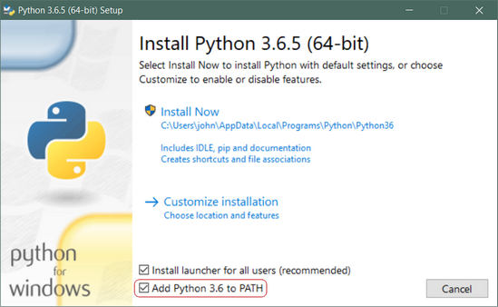

# First and foremost

Your Windows 10 PC needs a little setup work before you can start writing and running Python programs.

## Install Python 3

Your system cannot just read your program and understand it. It needs the help of an interpreter to translate your program into a language that it understands (and you probably don't).

1. Download the [Python 3 installer](https://www.python.org/ftp/python/3.8.2/python-3.8.2.exe) and install Python 3. Remember to check the "Add Python 3.8.2 to PATH" box whenever it shows up.

    

    That should be all there is to it. A few minutes later you should have a working Python 3 installation on your system.

## Prepare an IDE (Integrated Development Environment) for your coding experience
There are specialised editors for coding (which are refered to as IDEs although they are actually more than editors) that contain useful functionalities to assist you, use them.
Typically you should simply use your favourite IDE in the past, but if you are new to programming, [Visual Studio Code](https://code.visualstudio.com/) by Microsoft is what the author would recommend as it will be used in the demonstrations throughout this tutorial. It has a free community version.
